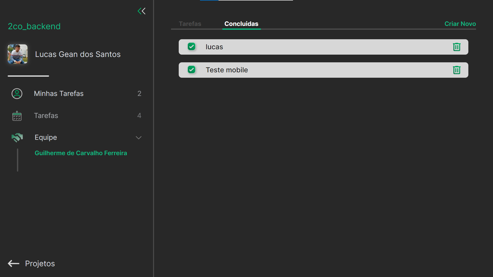

<h1 align="center">2CO</h1>

Aplicação cujo objetivo é organizar tarefas(ToDos) de uma equipe de desenvolvimento, este projeto foi desenvolvido como um trabalho no terceiro semestre do desenvolvimento de software multiplataforma da fatec de Franca
  

### 🔗 Links:
<a href="https://github.com/LucasTKP/2co">Github - Front-End</a>
<a href="https://github.com/LucasTKP/2co_backend">Github - Back-End</a>
<a href="https://www.figma.com/file/mKneVxql3uZ310w4NwqvF1/Untitled?type=design&node-id=0%3A1&mode=design&t=efgT8jDNLr4FjZoB-1">Figma</a>
<a href="https://cayksite123.atlassian.net/jira/software/c/projects/P2CO/boards/3?atlOrigin=eyJpIjoiNjEyOTYyMzE3NTUxNDU4ZTlhNTQxYmY3ZmZjYTVkZDMiLCJwIjoiaiJ9">Jira</a>
<a href="https://2co-sigma.vercel.app">Deploy</a>

### 💻 Projeto:

Este projeto consiste em um organizador de tarefas cujo objetivo é auxiliar uma equipe de desenvolvimento de software, organizando as tarefas de cada membro.

   

### 🎯 Objetivo:

Fazer o trabalho interdisciplinar do terceiro semestre da faculdade de desenvolvimento de software multiplataforma na Fatec Franca

   

### ⚙️ Tecnologias:

- Next Js
- Tailwind
- Css
- JavaScript
- Node Js
- Prisma
     

### 📷 Tela principal:

  

 
